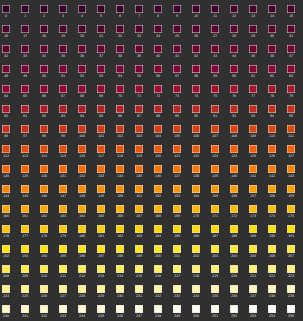

# osm-strava

## Detection of missing ways in OpenStreetMap based on Strava heatmaps

### Introduction

This program will detect missing ways in OSM for your favorite area, and generate a GeoJSON file that will enable you to create a [MapRoulette](https://maproulette.org/) challenge.

### Installation

Download the strava.py file on your computer. Then, create the directory */var/cache/strava* to store the Strava heat map tiles.

You may have to install some libraries if they are not already installed :

- [pillow](https://pypi.org/project/Pillow/)
- [numpy](https://numpy.org/)
- [shapely](https://pypi.org/project/shapely/)

### Usage

```
usage: strava.py [-h] [-a AREA] [-m MINLEVEL] [-d DISTANCE] [-s SIZE] [-z ZOOM] [-c ACTIVITY] [-o OFFSET] [-b TASKS_DB] [-g GEOJSON] [-v] [-q] [-x X] [-y Y] [--debug]

optional arguments:
  -h, --help            show this help message and exit
  -a AREA, --area AREA  Area of interest (GeoJSON)
  -m MINLEVEL, --minlevel MINLEVEL
                        Minimum Strava level (0-255)
  -d DISTANCE, --distance DISTANCE
                        Maximum distance between Strava hot point and OSM way
  -s SIZE, --size SIZE  Minimum size of Strava trace (in pixels)
  -z ZOOM, --zoom ZOOM  Strava zoom level (10-15)
  -c ACTIVITY, --activity ACTIVITY
                        Strava activity (default=run)
  -o OFFSET, --offset OFFSET
                        Strava tile offset (0-3)
  -b TASKS_DB, --tasks_db TASKS_DB
                        Tasks database
  -g GEOJSON, --geojson GEOJSON
                        Output file
  -v, --verbose         Display more information
  -q, --quiet           Do not display progress
  -x X, --x X           Strava Tile x coordinate (for debugging)
  -y Y, --y Y           Strava Tile y coordinate (for debugging)
  --debug               Debug mode
```

### Description of parameters

#### -a \<GeoJSON file\>, --area \<GeoJSON file\>

The GeoJSON file must contains a multipolygon (or a collection of) describing the limits of the area of interest. You can download these files on the [OSM-Boundaries](https://osm-boundaries.com/) website.

#### -m \<Level\>, --minlevel \<Level\>

The threshold of Strava traces intensity. The range is [0,255] and the default value is 100.

The image below shows the colours of all the intensities :


#### -d \<Distance\>, --distance \<Distance\>

The minimal distance, in meters, from an OSM way to enable the detection. (default = 35).

#### -s \<Size\>, --size \<Size\>

Minimum size of Strava trace (in pixels) (default = 20).

#### -z \<Zoom\>, --zoom \<Zoom\>

Strava zoom level (10-15). **Warning**: only the level 15 has been tested (default value).

#### -c \<ACTIVITY\>, --activity \<ACTIVITY\>

Strava activity (default=run)

#### -o \<OFFSET\>, --offset \<OFFSET\>

Strava tile offset (0-3). See below.

####  -g \<output file\>, --geojson \<output file\>

Output file to be imported in MapRoulette.

#### -b \<Tasks_database\>, --tasks_db \<Tasks_database\>

Tasks database. If you do several rounds (see worflow explained below), this database must contain the MapRoulette tasks already processed, to avoid new detection of tasks marked as "Not an issue".

#### -x \<X\>, --x \<X\> and -y \<Y\>, --y \<Y\>

For debugging, instead of providing an area, you can provide the x and y coordinates of the Strava tile you want to process.

### Workflows

This is an iterative process. When the MapRoulette challenge is finished, you can run again strava.py to detect more missing ways, for example by lowering the detection thresholds. You'll stop when there are too many tasks marked as "Not an issue".

#### Simple workflow

- Step #1: Download the boundary of your area of interest on the [OSM-Boundaries](https://osm-boundaries.com/) website.
- Step #2: Run strava.py.
- Step #3: Create a new MapRoulette challenge and import the GeoJSON file created in step #2.
- Step #4: Wait until the MapRoulette challenge is finished.
- Step #5: In MapRoulette, export the project data in CSV format (see [Exporting Challenge Data](https://learn.maproulette.org/documentation/exporting-challenge-data/)).
- Step #6: Convert the CSV file to a Sqlite3 database:

`sqlite3 tasks.sqlite ".import --csv project_XXXXX_tasks.csv tasks" "create index tasks_idx on tasks(TaskName);"`
- Step #7: Run again strava.py with the new "-b tasks.sqlite" parameter.
- Step #8: Rebuild the MapRoulette challenge to add the new tasks.

Repeat steps #4 to #8 until there are too many tasks marked as "Not an issue".

#### Advanced workflow

To minimize the multiple detection of missing ways, you may choose to avoid processing of contiguous Strava heatmap tiles.

- Step #1: Download the boundary of your area of interest on the [OSM-Boundaries](https://osm-boundaries.com/) website.
- Step #2: Run strava.py with the "-o 0" parameter.
- Step #3: Create a new MapRoulette challenge and import the GeoJSON file created in step #2.
- Step #4: Wait until the MapRoulette challenge is finished.
- Step #5: Run strava.py with the "-o 1" parameter.
- Step #6: Rebuild the MapRoulette challenge to add the new tasks.
- Step #7: Wait until the MapRoulette challenge is finished.
- Step #8: Run strava.py with the "-o 2" parameter.
- Step #9: Rebuild the MapRoulette challenge to add the new tasks.
- Step #10: Wait until the MapRoulette challenge is finished.
- Step #11: Run strava.py with the "-o 3" parameter.
- Step #12: Rebuild the MapRoulette challenge to add the new tasks.
- Step #13: Wait until the MapRoulette challenge is finished.
- Step #14: In MapRoulette, export the project data in CSV format (see [Exporting Challenge Data](https://learn.maproulette.org/documentation/exporting-challenge-data/)).
- Step #15: Convert the CSV file to a Sqlite3 database:

`sqlite3 tasks.sqlite ".import --csv project_XXXXX_tasks.csv tasks" "create index tasks_idx on tasks(TaskName);"`
- Step #16: Run strava.py with the new "-b tasks.sqlite" parameter and with the "-o 0" parameter.
- Step #17: Rebuild the MapRoulette challenge to add the new tasks.
- Step #18: Wait until the MapRoulette challenge is finished.
- Step #19: Run strava.py with the "-b tasks.sqlite" and the "-o 1" parameter.
- Step #20: Rebuild the MapRoulette challenge to add the new tasks.
- Step #21: Wait until the MapRoulette challenge is finished.
- Step #22: Run strava.py with the "-b tasks.sqlite" and the "-o 2" parameter.
- Step #23: Rebuild the MapRoulette challenge to add the new tasks.
- Step #24: Wait until the MapRoulette challenge is finished.
- Step #25: Run strava.py with the "-b tasks.sqlite" and the "-o 3" parameter.
- Step #26: Rebuild the MapRoulette challenge to add the new tasks.
- Step #27: Wait until the MapRoulette challenge is finished.

Repeat steps #14 to #27 until there are too many tasks marked as "Not an issue".
